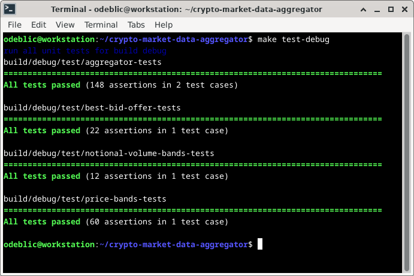
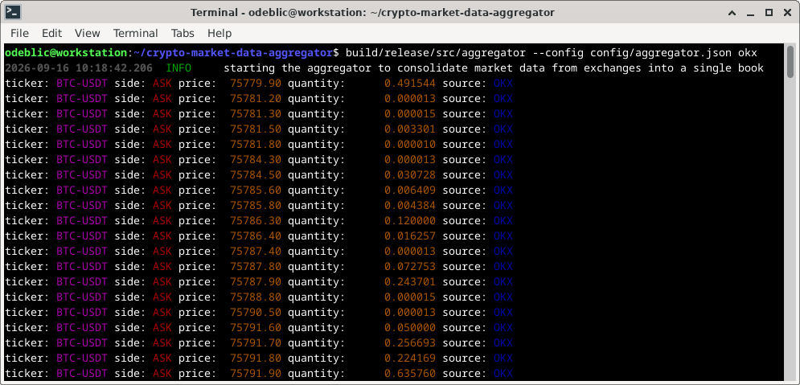
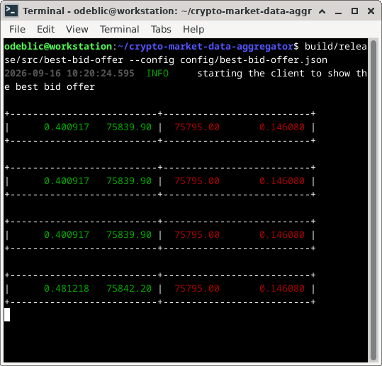
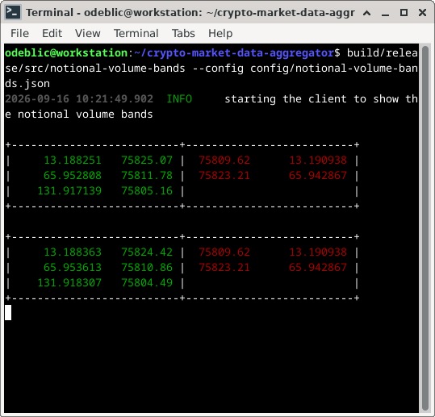
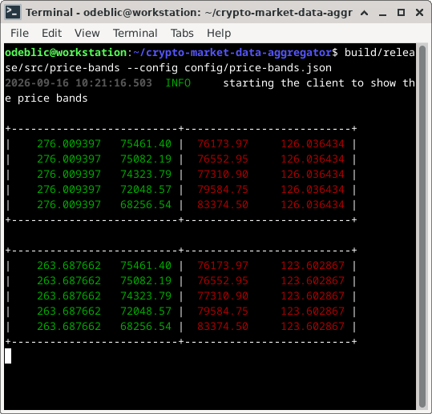
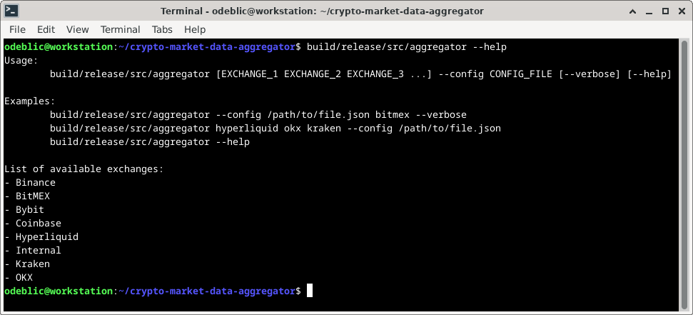
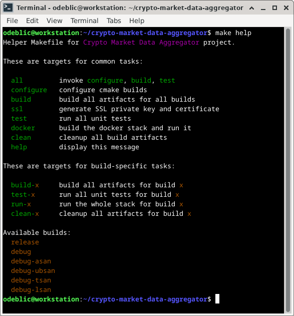
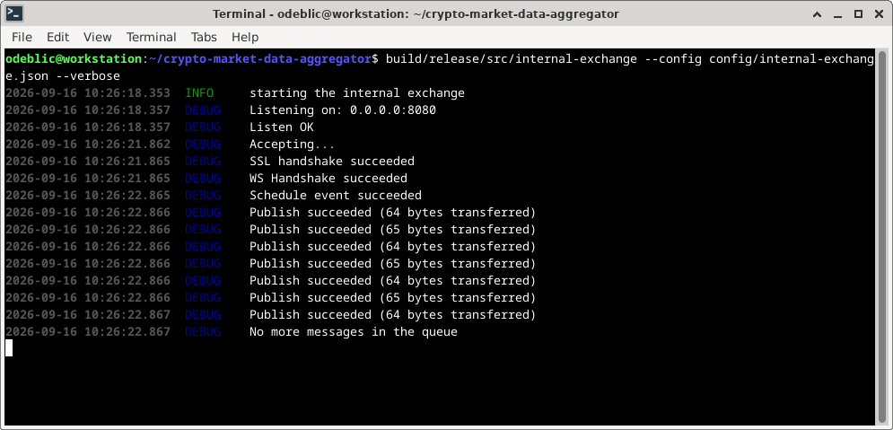
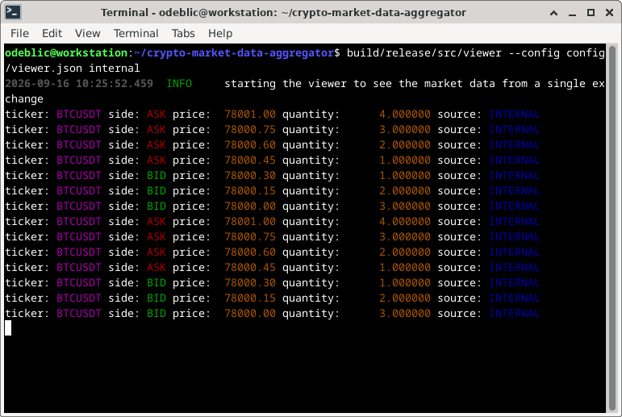

# Crypto Market Data Aggregator

> A market data aggregator that connects to several crypto exchanges and
> consolidate quotes into a single book, which is then published internally
> and consumed by various clients.

## Specifications


> DISCLAIMER: In spite of the time spent and the efforts made on this project,
> it is not considered to be production-ready but aims to advertise on best
> practices of the industry for high-frequency trading.

## Project layout

| Folder      | Content                                           |
| ----------- | ------------------------------------------------- |
| `prototype` | connectors to exchanges written in Python         |
| `doc`       | documentation and screenshots                     |
| `cmake`     | scripts used by CMake for self-contained builds   |
| `src`       | application code that actually goes to production |
| `proto`     | gRPC definitions for market data protocol         |
| `test`      | code of all unit tests                            |
| `config`    | JSON configuration files for each executable      |
| `docker`    | specifications for the Docker stack               |

## Prototyping

Crypto business is huge and sometimes not as standardized as we might like.
Surprised are not uncommon and for this reason, it is advisable to explore
the CEX part by prototyping the connectivity in Python.

The purpose is to explore the API of each exchange and discover the data.

Only after being able to collect unified market data, the implementation
in C++ can start on safe grounds.

### Executables

Internal Exchange

+ publishes fake market data for testing
+ only used for debugging
+ not a deliverable to this point
+ to be extended to become an internal matching engine

> It provides some fake market data for testing purpose but can be modified to do more.

Aggregator

+ connects to several exchanges
+ subscribes to BTC/USDT
+ aggregate quotes in a single book
+ publishes the feed

> It consolidates market data from several exchanges, builds a crossed book, and publishes it.

Best Bid Offer Client

+ connects to the aggregator
+ consumes the market data feed
+ extracts the top of the book
+ prints the result on the console

> It gives the best price on the market for buying and selling, and what quantity is available.

Notional Volume Bands Client

+ connects to the aggregator
+ consumes the market data feed
+ calculates the price and quantity per notional
+ prints the result on the console

> It gives the average price (weighted by quantities) for a certain amount of notional.

Price Bands Client

+ connects to the aggregator
+ consumes the market data feed
+ calculates the cumulate quantity available per relative price
+ prints the result on the console

> It gives an idea of the market depth for a certain price.

## Design and architecture


### Dependencies of the project

+ Beast for websockets
+ Boost for utils (lockfree queue, asio, etc.)
+ Catch2 for unit tests
+ nlohmann/json for JSON


[CMake](https://cmake.org)

[Boost](https://www.boost.org)

[Beast](https://www.boost.org/doc/libs/latest/libs/beast/doc/html/index.html)

[nlohmann/json](https://github.com/nlohmann/json)

[Catch2](https://github.com/catchorg/Catch2)

## Build

Everything is designed to run on **Linux** (tested on Debian 12).

**GCC** compiler is recommended (tested with version 12.2.0).

The build engine is [CMake](https://cmake.org) (tested with version 3.25.1).

The code requires to be compiled with **C++20** support.

```sh
# configure and build in debug mode
cmake -B build/debug -DCMAKE_BUILD_TYPE=Debug
cmake --build build/debug

# configure and build in release mode
cmake -B build/release -DCMAKE_BUILD_TYPE=Release
cmake --build build/release
```

NB: For a self-contained build (cf. `USE_FETCH_CONTENT` in [CMakeLists.txt](CMakeLists.txt)),
an Internet connection is necessary as dependencies will be downloaded from [GitHub](https://github.com).

## Test and debug

```sh
# run unit tests
build/debug/test/aggregator-tests
build/debug/test/best-bid-offer-tests
build/debug/test/notional-volume-bands-tests
build/debug/test/price-bands-tests
```



## Usage of the program

Each binary must be run with its JSON configuration:

```sh
# the aggregator must be started first
build/release/src/aggregator --config config/aggregator.json binance coinbase okx

# only then clients can be started in any order
build/release/src/best-bid-offer --config config/best-bid-offer.json
build/release/src/notional-volume-bands --config config/notional-volume-bands.json
build/release/src/price-bands --config config/price-bands.json
```









Each binary shows its CLI usage:



A Docker stack is available to run everything in containers.
It is recommended to use the helper Makefile to do the job:

```sh
make docker
```

## Tooling at the rescue

A helper Makefile is provided for common tasks, which avoids
typing tedious commands each time there are needed:

```sh
make help
```



An internal exchange gives control on the market data and
allows to reproduce scenarios on the market.

```sh
build/release/src/internal-exchange --config config/internal-exchange.json
```




A market data viewer can connect to a CEX and prints
its market data. It is to validate the connectivity.

```sh
build/release/src/viewer --config config/viewer.json internal
```



## Todo

Features:

+ internal exchange: make the market data configurable by JSON
+ add a client to show statistics (high price, low price, market depth, etc.)
+ implementation of ticker-aware subscriptions was started but needs to be completed

Performance:

+ consider using `boost::asio::write` for internal exchange
+ migrate from snapshots (state) to update (diff) feeds to scale up

Robustness:

+ add Valgrind setup to investigate potential issues
+ write additional unit tests for technical functions
+ pullback quotes on CEX disconnection (reset quantities)
+ normalize prices by rounding at 2 digits and store them as integers
+ normalize quantities and store them as integers
+ revamp CEX message handling and use safer JSON parsing

Code maintenability:

+ add Doxygen comments to document public interfaces
+ modernize formatting using `std::format`
+ separate the code in `.hpp` and `.cpp` files
+ have better neming for files and classes to make them more meaningful
+ groupd CEX-specific source files by exchange (cex/bitmex/*.hpp)
+ add namespaces to separate symbols by business

Fixes:

+ to be found...

## Support

Please contact [Olivier de BLIC](mailto:odeblic@gmail.com) for any question or request.
